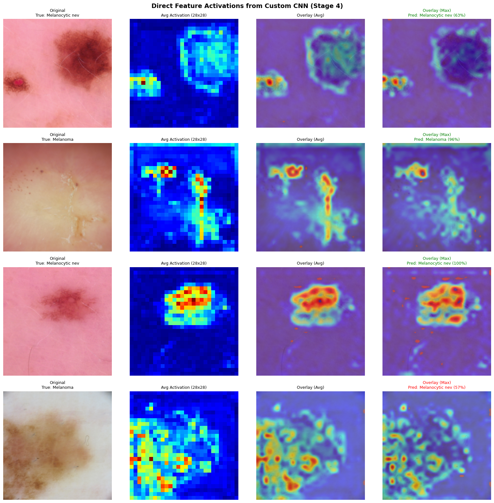
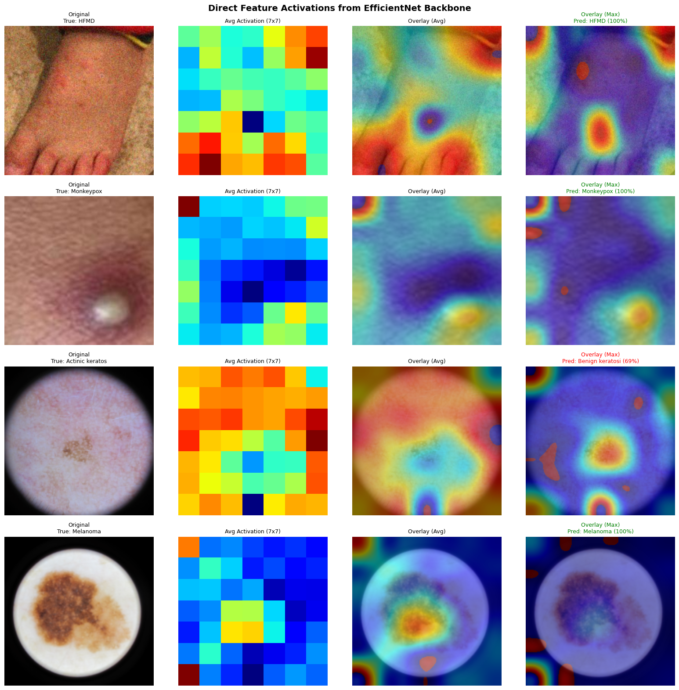
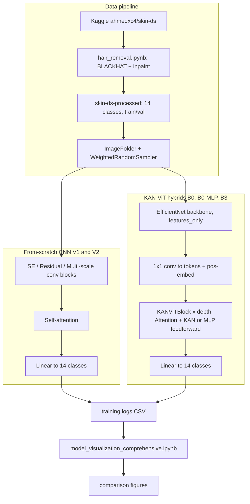

# Skin Lesion Classification: CNN and KAN-ViT Hybrids

An empirical comparison of six image classifiers on a 14-class skin condition
dataset. Two are convolutional networks built and trained from scratch, and four
are hybrids that pair a pretrained backbone with vision-transformer blocks built
on [Kolmogorov-Arnold Network (KAN)](https://arxiv.org/abs/2404.19756) spline
layers. Two of them convert transformer blocks to KAN feedforwards, and the
other two alternate KAN and standard MLP feedforwards across the blocks, a novel
element for this task. Every model is trained and evaluated on the same
processed dataset.

The best result comes from the smallest model: the from-scratch Custom CNN V1
reaches 87.7% test accuracy with test-time augmentation on 9 MB of weights,
ahead of every KAN-ViT hybrid.

> For per-model architecture and training configuration, see
> [MODELS.md](MODELS.md). For dataset composition and preprocessing, see
> [DATASET.md](DATASET.md).

## Overview

Two design directions are compared.

The first is a purpose-built CNN, `SkinLesionCNN`, trained from random
initialization. It combines squeeze-and-excitation, residual, and multi-scale
convolution blocks with a single self-attention layer before the classifier
head. Version 1 trains with cross-entropy. Version 2 keeps the architecture and
swaps in focal loss to test whether it helps the long-tailed class distribution.

The second direction integrates KAN spline layers into vision-transformer
blocks. The plain KAN-ViT is a timm ViT at 160px with a frozen backbone. Its
first two blocks become KAN feedforwards, and only those blocks and the head
train. EfficientNetB0-KANViT builds four KAN blocks on top of a frozen
EfficientNet-B0. The two `-MLP` variants add a novel element, an alternating
KAN-MLP block that interleaves KAN and standard MLP feedforwards across the
transformer blocks (`use_kan = i % 2 == 0`) instead of using KAN throughout.
They run on EfficientNet-B0 with the last backbone blocks fine-tuned, and on
EfficientNet-B3 at 224px, testing whether spline activations can match a
well-tuned CNN.

The dataset mixes dermoscopy lesion classes (melanoma, nevi, carcinomas) with
infectious rash classes (monkeypox, chickenpox, measles, and others) across 14
labels, and is heavily imbalanced. Every run uses a weighted sampler, and v2
additionally uses focal loss.

## Results

Validation accuracy is the selection metric. All figures are regenerated by
`model_visualization_comprehensive.ipynb` from the per-epoch training logs.

| Model | Epochs | Best val acc | Best epoch | Final train acc | Gen. gap | Weights |
|-------|--------|--------------|------------|-----------------|----------|---------|
| Custom CNN V1 | 100 | 87.19% | 92 | 91.70% | 4.87% | 9.1 MB |
| Custom CNN V2 | 100 | 86.72% | 81 | 91.55% | 5.21% | 9.1 MB |
| KAN-ViT | 30 | 80.03% | 28 | 79.97% | -0.06% | 164 MB |
| EfficientNetB0-KANViT | 35 | 81.99% | 32 | 83.98% | 2.45% | 772 MB |
| EfficientNetB0-KANViT-MLP | 25 | 81.39% | 19 | 87.40% | 6.11% | 98 MB |
| EfficientNetB3-KANViT-MLP | 50 | 84.40% | 44 | 90.16% | 6.69% | 123 MB |

Custom CNN V1 is both the most accurate and by far the smallest. The KAN-ViT
hybrids do not close the gap within their training budgets, and the larger
EfficientNet-B3 hybrid is the strongest of them at 84.40%. Focal loss (V2) did
not improve on plain cross-entropy (V1) on this split.

On a held-out test set, with test-time augmentation for the CNN, the Custom CNN
reaches 87.7% and the four hybrids reach 79.62% (KAN-ViT), 83.01%
(EfficientNetB0-KANViT), 82.46% (EfficientNetB0-KANViT-MLP), and 85.44%
(EfficientNetB3-KANViT-MLP). The ranking is unchanged.

Summary figures: `best_accuracy_comparison.png`, `training_curves_combined.png`,
`model_radar_comparison.png`.

## Attention maps

Feature activations overlaid on sample lesions. Warm regions are where the
network responds most strongly. Both model families concentrate on lesion cores
and boundaries instead of background skin.

### Custom CNN


### KAN-ViT hybrid


## Repository structure

```
skin_lesion/
├── custom cnn v1/                           SkinLesionCNN, cross-entropy, 100 epochs
│   ├── custom-cnn-skin-lesion.ipynb
│   └── cnn_v1_training_logs.csv
├── custom cnn v2/                           SkinLesionCNN, focal loss, 100 epochs
├── kanvit/                                  plain ViT (160px) with KAN MLP, 30 epochs
├── efficientnetb0_kanvit/                   EfficientNet-B0 frozen + KAN-ViT, 35 epochs
├── b0_kanvit_with_mlp_unfreezed backcone/   EfficientNet-B0 fine-tuned + KAN-ViT-MLP, 25 epochs
├── efficientnetb3_kanvit_mlp/               EfficientNet-B3 + KAN-ViT-MLP, 50 epochs
├── hair_removal.ipynb                       dataset hair-removal preprocessing
├── model_visualization_comprehensive.ipynb  cross-model comparison figures
├── model_comparison_summary.csv             the results table above
├── MODELS.md   DATASET.md
└── *.png                                    generated comparison figures
```

Each model folder is self-contained: a training notebook and a
`*_training_logs.csv` with per-epoch loss, accuracy, and learning rate. Trained
weights (`.pth`) and the image dataset are not tracked in git. See
[Pretrained weights](#pretrained-weights) and [Dataset](#dataset).

## Pipeline



The plain KAN-ViT variant is a timm ViT at 160px with its first two blocks
converted to KAN feedforwards. Unlike the other three hybrids it has no
EfficientNet backbone. See [MODELS.md](MODELS.md).

## Dataset

The processed dataset holds 32,982 images across 14 classes, split into train
(29,322) and val (3,660) as an `ImageFolder` tree. It originates from the Kaggle
dataset `ahmedxc4/skin-ds` and is passed through `hair_removal.ipynb`, which
removes hair artifacts with a BLACKHAT morphological mask and Telea inpainting
before writing `skin-ds-processed`. The distribution is long-tailed, from 10,300
training images for melanocytic nevi down to 191 for dermatofibroma. Full
per-class counts and licensing notes are in [DATASET.md](DATASET.md).

## Installation

Python 3.10 or newer, in a fresh virtual environment.

```bash
pip install torch torchvision timm kagglehub opencv-python \
    scikit-learn pandas numpy matplotlib seaborn tqdm torchinfo pillow
```

The KAN spline layers are defined inline in the notebooks, so no separate KAN
package is required to run them. `kagglehub` is needed only to download the raw
dataset.

## Reproducing

The training notebooks were written for Kaggle GPU kernels. Paths such as
`/kaggle/input/skin-ds/` and `/kaggle/working/` are hardcoded and must be
repointed to run elsewhere. Fetch the raw dataset with:

```python
import kagglehub
path = kagglehub.dataset_download("ahmedxc4/skin-ds")
```

Run `hair_removal.ipynb` once to produce `skin-ds-processed`, then open any model
notebook to train from scratch or evaluate from a checkpoint.
`model_visualization_comprehensive.ipynb` reads the `*_training_logs.csv` files
and regenerates every comparison figure. Set its `WORKSPACE` constant to the
repository root first.

## Pretrained weights

The six trained checkpoints are published on Hugging Face Hub at
[diddoe/skin-lesion-classifiers](https://huggingface.co/diddoe/skin-lesion-classifiers).
Each file keeps its repo-relative path, for example
`custom_cnn_v1/v1_custom_cnn_skin_lesion_100_epochs.pth`.

```python
from huggingface_hub import hf_hub_download

path = hf_hub_download(
    "diddoe/skin-lesion-classifiers",
    "custom_cnn_v1/v1_custom_cnn_skin_lesion_100_epochs.pth",
)
```

Rebuild the matching architecture from [MODELS.md](MODELS.md), then load with
`model.load_state_dict(torch.load(path))`.

## Notes

- Weights, the dataset, and agent-authored docs are git-ignored and either
  reproduced from the notebooks or hosted on Hugging Face Hub.
- Class imbalance is handled with a `WeightedRandomSampler` in every run, and
  additionally with focal loss in Custom CNN V2.
- Explicit hair-removal preprocessing was evaluated and did not improve accuracy.
  It is kept for reproducibility.
- Only `hair_removal.ipynb` fixes a seed (42). The other notebooks do not, so
  exact runs are not bit-reproducible.
- `create_kan_vit` defaults to `num_classes=14`.
